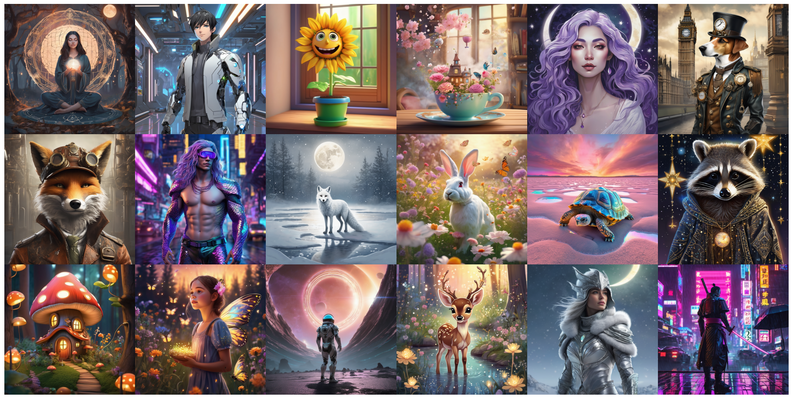
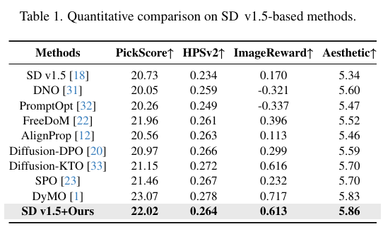
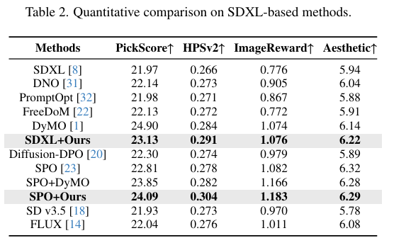

# CritiFusion: Semantic and Spectral Refinement for Text-to-Image Diffusion
<div align="center">

## **Paper ID 9907**

</div>

CritiFusion is a training-free, inference-time refinement framework designed to enhance semantic alignment and visual quality in text-to-image diffusion models.  
It operates as a modular plug-in stage on top of SDXL pipelines, without any additional finetuning or reward optimization.

<p align="center">
  
</p>

---

## Overview

Recent diffusion models achieve impressive photorealism, yet they still struggle with long, compositional, or attribute-heavy prompts. Typical failure modes include:

- Missing or hallucinated objects  
- Incorrect attributes (color, count, style)  
- Inconsistent global structure when attempting local edits  

CritiFusion addresses these issues with two complementary modules:

- **CritiCore** — a multimodal semantic critic built on an ensemble of LLMs plus a VLM.  
  It rewrites the prompt into a structured, CLIP-friendly form while preserving the user’s intent.
- **SpecFusion** — a spectral latent refinement stage that operates in the frequency domain.  
  It preserves low-frequency structure while injecting high-frequency detail via a single SDXL img2img step.

Together, these components provide a **training-free refinement layer** that can be placed after any SDXL-based generator to improve alignment and perceptual quality.

---

## Method

<p align="center">
  
</p>

### CritiCore: Multimodal Semantic Critique

CritiCore receives the original user prompt and, optionally, an initial image. It then:

  1. Uses a **multi-LLM ensemble** to decompose the prompt into semantically coherent clauses and tags.  
  2. Aggregates the ensemble outputs into a stable set of positive and negative tags, with CLIP-77-safe truncation and ordering.    
  3. Invokes a **VLM-based critique** to analyze the mismatch between the initial image and the target description.  
  4. Merges textual tags and VLM feedback into a refined prompt that is better aligned with the target semantics, while remaining faithful to user intent.

The result is a strengthened conditioning signal that rephrases the original instruction into a form more suitable for diffusion-based generators.

### SpecFusion: Spectral Latent Refinement

SpecFusion operates on SDXL latents and combines:

- A **CADR-style mapping** from alignment scores to sampling parameters  
  (e.g., guidance scale, number of steps, latent noise strength).  
- A **frequency-domain fusion** step that merges a “structural” latent with a “detail-enhanced” latent:
  - Low frequencies preserve composition and camera geometry.  
  - High frequencies inject sharper textures and local details.  

This yields a single-step img2img refinement that improves fidelity without destabilizing the original layout.

---

## Gallery

<p align="center">
  
  
  
</p>

The gallery illustrates consistent improvements across diverse prompts and artistic styles, including complex indoor scenes, crowds, landscapes, and abstract compositions.

---

## Installation

```bash
pip install -r requirements.txt
```

Set your Together API key (required for LLM and VLM critique):

```bash

export TOGETHER_API_KEY=your_key_here
```
On Windows (PowerShell):

```bash
$env:TOGETHER_API_KEY = "your_key_here"
```

---
## Models and Configuration
CritiFusion relies on Together-hosted LLMs and VLMs. Model availability may change over time.

You can configure model choices in the code or configuration files, for example:

```bash

LLM_MULTI_CANDIDATES = [
    "meta-llama/Llama-3.3-70B-Instruct-Turbo",
    "Qwen/Qwen2.5-72B-Instruct-Turbo",
    "Qwen/Qwen2.5-Coder-32B-Instruct",
    "deepseek-ai/DeepSeek-V3",
    "nvidia/NVIDIA-Nemotron-Nano-9B-v2",
]

AGGREGATOR_MODEL = "Qwen/Qwen2.5-72B-Instruct-Turbo"

VLM_CANDIDATES = [
    "meta-llama/Llama-4-Maverick-17B-128E-Instruct-FP8"
]
```
If you encounter API errors or model unavailability, update these lists to currently supported models and re-run.

---

## Running CritiFusion
In the minimal setup, you can use the notebook critifusion.ipynb (or equivalent scripts) to:

Generate base SDXL images from prompts.

Run CritiCore for multi-LLM decomposition, VLM critique, and prompt refinement.

Apply SpecFusion to perform latent-level refinement using CADR-mapped parameters.

Visualize different variants (baseline, multi-LLM only, VLM only, full CritiFusion).

Typical workflow inside the notebook:

- Step 1: Load SDXL base and img2img pipelines.

- Step 2: Define LLM/VLM model lists and CritiCore presets.

- Step 3: Run the end-to-end pipeline to obtain:

  - Original base output

  - Refined outputs after CritiCore

  - Final images after SpecFusion

---

## Evaluation Metrics Explained
We evaluate each method using four human-aligned metrics:

- **PickScore↑**<br>
  Global human preference predictor that reflects overall image quality and prompt consistency.

- **HPSv2 ↑**<br>
  Measures semantic fidelity and compositional correctness relative to the text prompt.

- **ImageReward ↑**<br>
  Reward-model-based assessment of text–image alignment and realism.

- **Aesthetic ↑**<br>
  Predicts visual appeal independently of the prompt, focusing on composition, lighting, and style.

Higher is better for all four metrics.

---

## Results
<p align="center">   </p>
Across multiple backbones and prompt sets, CritiFusion delivers consistent gains in PickScore, HPSv2, ImageReward, and Aesthetic Score.
The framework closes much of the gap to training-based alignment methods while preserving the simplicity of a training-free, plug-in design.

---

## Limitations and Notes
- CritiFusion depends on external LLM and VLM APIs, which introduces latency and requires network access.

- The effectiveness of CritiCore depends on the quality and diversity of the underlying language models.

- SpecFusion is currently tailored to SDXL latent geometry; extending to other architectures may require additional tuning.
